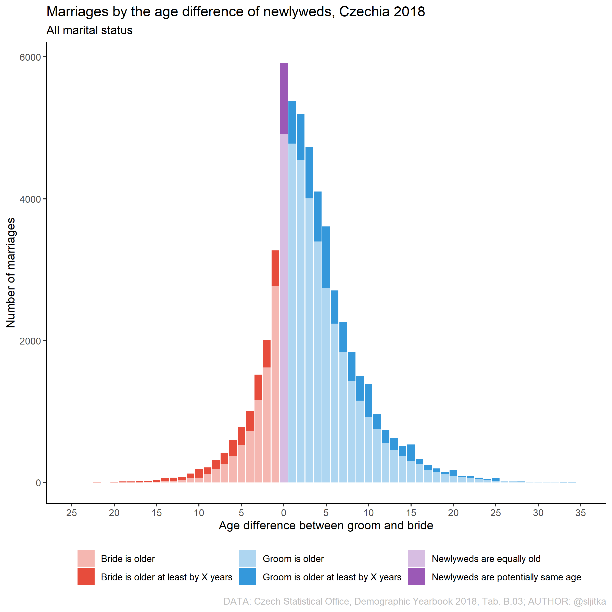
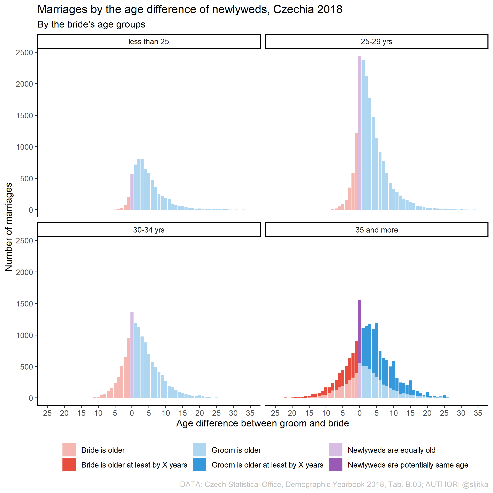
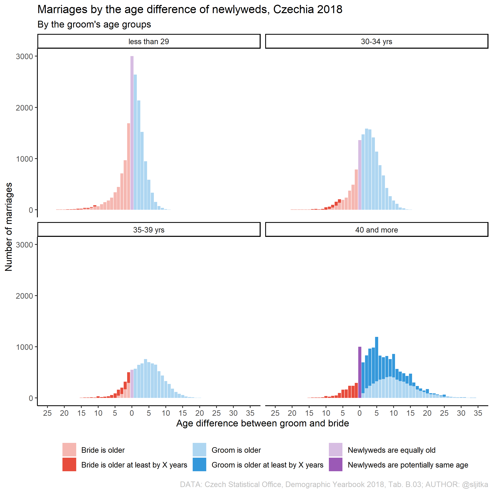

Jak již bylo zmíněno v úvodu, eRko je moje aktuální velká vášeň. Začala jsem psát učební text na téma úvod do R pro demografy (v češtině). Uvidíme jak to dopadne, první kapitola je aktuálně v recenzi u Aničky Altové. Zároveň by tato záložka měla být vhodným odpadkovým košem pro veškerou moji R-prokrastinaci.

## Vzajemný věk svobodných snouvenců, Česko 2018
Na základě dat z Demografické ročenky pro rok 2018 zde vizualizuji vzájemný věk svobodných snoubenců při sňatku. Lze pozorovat, že novomanželé byly nejčastěji stejného nebo alespoň podobného věku. Zohlednímeli věk něvesty, pak podíl starších partnerů s rostoucím věkem nevěsty klesá. Oproti tomu starší svobodní muži si berou častěji mladší parnerky než jejich mladší kolegové. Nic nového pod sluncem.  

