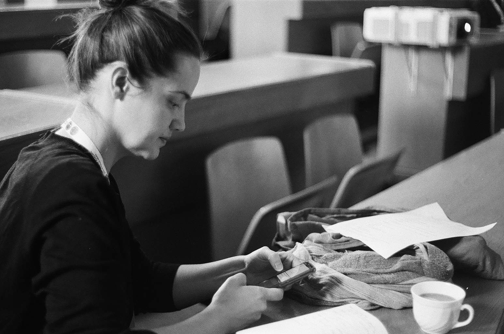

<link rel="stylesheet" href="styles.css" type="text/css">

Na podzim 2010 jsem nastoupila do studia demografie na [Univerzitě Karlově](http://https://www.natur.cuni.cz/geografie/demografie-a-geodemografie) a od té doby jsem z něj zatím nevystoupila. Při troše dobré vůle bych na v počátkem roku 2021 mohla ukočit svoji oficiální studijní etapu a úspěšně zakončit doktorské studium. 

Po těch necelých deseti letech mám bezpochyby uričtě znalosti v oblasti demografické analýzy a demografického vývoje. Zároveň jsem značně poznamenána statistikou, sociální geografií a sociologií. 

Po celou dobu studia se ukázalo, že jsem značným nadšencem osvojování si každého nového programu který potkám. Pomineme-li nabídku MS Office, které vládnu nadprůměrnými uživatelskými znalostmi běžné kancelářské krysy, pak jsem prošla i obdobím intenzivního užívání ArcGIS, SAS a SPSS. Po předchozích drobných snahách nastal v červenci 2019 v [Barceloně](https://ced.uab.cat/courses/barcelona-summer-school-of-demography/) zásadní průlom a stala jsem se nadšeným uživatlem eRka a především R Studia.

Závěrem k hlavnímu účelu těchto stránek. První důvod je jednoduše vyzkoušet si samostatnou tvrobu stránek pomocí R Studia a prostřednictvím GitHUbu. Druhým důvodem je blížící se konec doktorského studia a tedy i období hledání vhodné pracovní příležitosti, k čemuž by se veřejně viditelné CV snad mohlo i hodit.

Za foto děkuji [Aničce Altové](href: https://twitter.com/boruvka_a).

